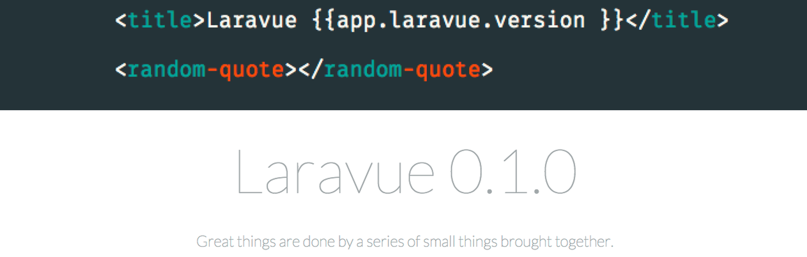

# Laravue - a sensible starting point for single-page apps

[![Latest Version on Packagist][ico-version]][link-packagist]
[![Software License][ico-license]](LICENSE.md)
[![Build Status][ico-travis]][link-travis]
[![Coverage Status][ico-scrutinizer]][link-scrutinizer]
[![Quality Score][ico-code-quality]][link-code-quality]
[![Total Downloads][ico-downloads]][link-downloads]


Laravue gives you a few things that may not sound like much, but are really the foundations of any app you may build:

1. a standard way to communicate from app -> view
2. a standard way to communicate from view -> app
3. a standard way to communicate from components -> view
4. a standard way to communicate from components -> app

Why would we want these features? Suppose we want to change the currentView from within a view. Right now, there’s no easy way to do that. Using Laravue, we can just run `@app.laravue.view ‘awesome’` .

Another example is if you want to have one user object served up from the backend that can be accessed application-wide. Just add it to the data object of your main app and it can be accessed from views using `@app.user` !

For more about this implementation of front-end architecture, check out [this post in Laravel News](https://medium.com/laravel-news/advanced-front-end-setup-with-vue-js-laravel-e9fbd7e89fe2)

## Install

Via Composer

``` bash
$ composer require league/laravue
```

## Usage

### Methods (on `laravue` object)
#### `view(name)`
This method changes the view component's `currentView` to the argument you passed it. The function will automatically add `-view` to the end of the name you pass it. If you're using coffeescript, like I suggest, you can just run `@app.laravue.view 'about'` and it will take you to the about page. If not, just run `this.app.laravue.view('about');`.

#### `call(view, method, args...)`
This method calls a method on another view, regardless of whether or not it's already loaded. If it is loaded, Laravue goes ahead and calls it. If not, we wait for the view to be loaded, then run the function. The first argument is the name of the view that you want to have a method called on. The second one is the name of the method you want run. Any arguments after that are passed into the method as arguments using javascript magic closures! To use it, go `@app.laravue.call('contacts', 'load')`. If you want to pass arguments, just go `@app.laravue.call('contacts', 'load', 'russweas@gmail.com')`. The third paramater, my email, will be passed into the `load()` method on the contacs-view component. For example, you might have:
```
module.exports =
  methods:
    load: (email) ->
      console.log email
  ready: () -> require '../view-ready.coffee'.call this # required for laravue to work
  props: ['app'] # if you want to use @app from within the view
```
#### `goToAnd(view, name, args...)`
`goToAnd()` is just a shorter way of running `call()` then `view()`. Really useful for most use case scenarios!

### Creating a new element component
First, create a new file in the `resources/assets/js/components` directory called `my-component.coffee`. Put all functionality in an object which you set to `module.exports`. If you want HTML for this element, create a `my-component.template.html` in the same directory. In the object your created in the `.coffee`, add a `template` key, and set it equal to a `require` statement to the template file. Also, in case you're wondering, shadow DOM is not enabled, but it shouldn't be too hard to set up (no promises). Then, go to the file `components.coffee`. Duplicate the latest line underneath components and rename it to suite your file you just created. The key you give it will be what you instantiate it with in html, i.e. if it's `my-component` you use `<my-component>` in HTML. The value should be a require statement pointing to the file. That's it, that easily can now start using your own element anywhere in your app!

### Creating a new view component
To create a new view component, first create a file in `resources/assets/js/views` called `about.coffee`, replacing about with the name you want your view to have. Paste the following code into it:
```
module.exports =
    ready: () -> require '../view-ready.coffee'.call this
    props: ['app']
```
Go into `components.coffee` and duplicate the last line under views. Replace the relevant fields with links to your new view. Be sure to keep the `-view` at the end of the key! This differentiates your view from stand-alone elements. Next, go into your `app.js` and add the name of your view to the `init` method called on the `laravue` instance. Your view should now be up and working! To test it out, go into `laravue.coffee` and on line 3, change the name of `currentView` to be your new view, again, keep the `-view`. To test it out, just go into a browser and refresh!

## Roadmap
- JWT Tokens.
- Nocoffee Version.
- Authentication API.
- Better documentation site.
- CLI for building views and components.
- Symetrical API where a Vue model is binded to a Laravel controller.
- Custom Elixir plugin to make this possible instead of npm scripts. `mix.laravue('app.js')`.
- Async callback anonymous function for call method, basically "OK thing happened here's what I do now that it's done."

## Change log

Please see [CHANGELOG](CHANGELOG.md) for more information what has changed recently.

## Testing

``` bash
$ composer test
```

## Contributing

Please see [CONTRIBUTING](CONTRIBUTING.md) for details.

## Security

If you discover any security related issues, please email russweas@gmail.com instead of using the issue tracker.

## Credits

- [Russell Weas][link-author]
- [All Contributors][link-contributors]

## License

The MIT License (MIT). Please see [License File](LICENSE.md) for more information.

[ico-version]: https://img.shields.io/packagist/v/league/laravue.svg?style=flat-square
[ico-license]: https://img.shields.io/badge/license-MIT-brightgreen.svg?style=flat-square
[ico-travis]: https://img.shields.io/travis/thephpleague/laravue/master.svg?style=flat-square
[ico-scrutinizer]: https://img.shields.io/scrutinizer/coverage/g/thephpleague/laravue.svg?style=flat-square
[ico-code-quality]: https://img.shields.io/scrutinizer/g/thephpleague/laravue.svg?style=flat-square
[ico-downloads]: https://img.shields.io/packagist/dt/league/laravue.svg?style=flat-square

[link-packagist]: https://packagist.org/packages/league/laravue
[link-travis]: https://travis-ci.org/thephpleague/laravue
[link-scrutinizer]: https://scrutinizer-ci.com/g/thephpleague/laravue/code-structure
[link-code-quality]: https://scrutinizer-ci.com/g/thephpleague/laravue
[link-downloads]: https://packagist.org/packages/league/laravue
[link-author]: https://github.com/rweas
[link-contributors]: ../../contributors
